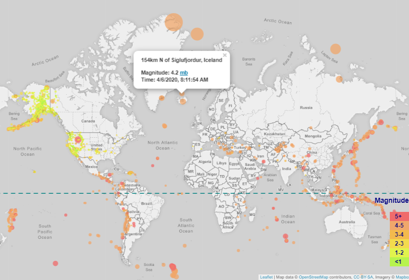

# Earthquakes Around the Globe in Past 30 Days
This is a mock project built to practice Leaflet with Javascript.

  

## Types of Magnitude

According to [United States Geological Survey (USGS)](https://earthquake.usgs.gov/data/comcat/data-eventterms.php#time), earthquake magnitude is a measure of the size of an earthquake at its source. It is a logarithmic measureand and there are various ways that magnitude may be calculated from seismograms. Different methods are effective for different sizes of earthquakes and different distances between the earthquake source and the recording station.

It is for this reason, that a hyperlink to the weblink that describes these measures has been included in the marker pop-up.
